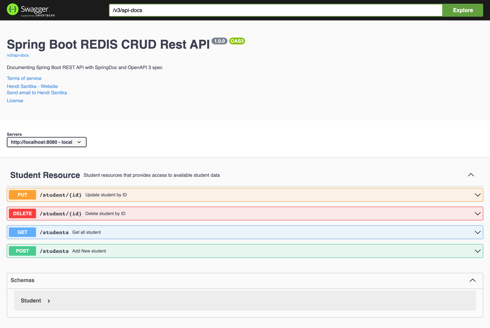

# springboot-data-redis-crud-example

[](https://github.com/hendisantika/springboot-data-redis-crud-example/actions/workflows/maven.yml)

A simple CRUD REST API for managing `Student` records, backed by Redis via Spring Data Redis, with Swagger/OpenAPI
documentation.

## Prerequisites

- JDK 25
- Redis server running locally on the default port (`6379`), or update `spring.data.redis.*` properties in
  `src/main/resources/application.properties` to point to your own instance.

## Getting Started

1. Clone this repository:
   ```shell
   git clone https://github.com/hendisantika/springboot-data-redis-crud-example.git
   ```
2. Navigate to the folder:
   ```shell
   cd springboot-data-redis-crud-example
   ```
3. Start Redis (if it isn't already running):
   ```shell
   redis-server
   ```
4. Run the application:
   ```shell
   ./mvnw spring-boot:run
   ```
5. Open your favorite browser: http://localhost:8080/swagger-ui.html

## API Endpoints

| Method | Path            | Description            |
|--------|-----------------|------------------------|
| POST   | `/students`     | Create a new student   |
| GET    | `/students`     | List all students      |
| PUT    | `/student/{id}` | Update a student by ID |
| DELETE | `/student/{id}` | Delete a student by ID |

## Building

```shell
./mvnw clean package
```

## Screenshot

Swagger UI


